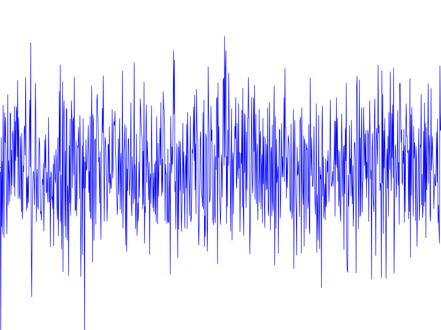

<!-- PROJECT SHIELDS -->
<!--
*** I'm using markdown "reference style" links for readability.
*** Reference links are enclosed in brackets [ ] instead of parentheses ( ).
*** See the bottom of this document for the declaration of the reference variables
*** for contributors-url, forks-url, etc. This is an optional, concise syntax you may use.
*** https://www.markdownguide.org/basic-syntax/#reference-style-links
-->
[![LinkedIn][linkedin-shield]][linkedin-url]

<!-- PROJECT LOGO -->
 

  

  <h3 align="center">Cointegration Trading w/ Machine Learning</h3>

<!-- TABLE OF CONTENTS -->

  
<h2 style="display: inline-block">Table of Contents</h2>

  <ol>
    <li>
      <a href="#about-the-project">About The Project</a>
      <ul>
        <li><a href="#built-with">Built With</a></li>
      </ul>
    </li>
    <li>
      <a href="#getting-started">Getting Started</a>
      <ul>
        <li><a href="#statistical-Background">Statistical Background</a></li>
        <li><a href="#Approach">Project Approach and Definition</a></li>
      </ul>
    </li>
    <li><a href="#Development">Development Details</a></li>
    <li><a href="#Issues">Challenges & Issues</a></li>
    <li><a href="#Online">Online Rollout</a></li>
    <li><a href="#contact">Contact</a></li>
    <li><a href="#acknowledgements">Acknowledgements</a></li>
  </ol>

<!-- ABOUT THE PROJECT -->
## About The Project

The Project main objetive was to explore the statistical properties of cointegration applied to pairs of companies stocks (B3-Brazil Listed Companies) in a manner where the equities could be traded in a Long & Short fashion, thus reducing capital required to trade and exposure to the market volatility. Secondary goal was to design and implement the framework to collect, store, manipulate and explore data from the B3 Database in the Cloud, building the path to other trading strategies that could benefit from the system backbone.

### Built With

* Python
* SQL
* Google Cloud
* Scikit / Sklearn / Statsmodels (*)
* Matplotlib / Seaborn (*)

(*) Python libraries used for ML/Statitical Methods and Data Preparation/Data Visualization,  

<!-- GETTING STARTED -->
## Getting Started

To get a local copy up and running follow these simple steps.

<!-- Statistical -->
### Statistical Background

<!-- Approach -->
### Project Approach and Definition

Use this space to show useful examples of how a project can be used. Additional screenshots, code examples and demos work well in this space. You may also link to more resources.

_For more examples, please refer to the [Documentation](https://example.com)_

<!-- Development -->
## Development Details

<!-- Issues -->
## Challenges & Issues

See the [open issues](https://github.com/ra024940/Pair_trading_Cointegration/issues) for a list of proposed features (and known issues).

<!-- Online -->
## Online Rollout

Contributions are what make the open source community such an amazing place to be learn, inspire, and create. Any contributions you make are **greatly appreciated**.

1. Fork the Project
2. Create your Feature Branch (`git checkout -b feature/AmazingFeature`)
3. Commit your Changes (`git commit -m 'Add some AmazingFeature'`)
4. Push to the Branch (`git push origin feature/AmazingFeature`)
5. Open a Pull Request

<!-- CONTACT -->
## Contact

Your Name - [@rafael_rdias](https://twitter.com/rafael_rdias) - rrdias108@gmail.com

Project Link: [https://github.com/ra024940/Pair_trading_Cointegration](https://github.com/ra024940/Pair_trading_Cointegration)

<!-- ACKNOWLEDGEMENTS -->
## Acknowledgements

* 
* 
* 

<!-- MARKDOWN LINKS & IMAGES -->
<!-- https://www.markdownguide.org/basic-syntax/#reference-style-links -->
[linkedin-shield]: https://img.shields.io/badge/-LinkedIn-black.svg?style=for-the-badge&logo=linkedin&colorB=555
[linkedin-url]: https://www.linkedin.com/in/rafadias/
