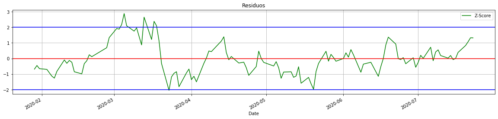

<!-- PROJECT SHIELDS -->
<!--
*** I'm using markdown "reference style" links for readability.
*** Reference links are enclosed in brackets [ ] instead of parentheses ( ).
*** See the bottom of this document for the declaration of the reference variables
*** for contributors-url, forks-url, etc. This is an optional, concise syntax you may use.
*** https://www.markdownguide.org/basic-syntax/#reference-style-links
-->
[![LinkedIn][linkedin-shield]][linkedin-url]

<!-- PROJECT LOGO -->
 

  

  <h3 align="center">Cointegration Trading w/ Machine Learning</h3>

<!-- TABLE OF CONTENTS -->

  
<h2 style="display: inline-block">Table of Contents</h2>

  <ol>
    <li>
      <a href="#about-the-project">About The Project</a>
      <ul>
        <li><a href="#built-with">Built With</a></li>
      </ul>
    </li>
    <li>
      <a href="#getting-started">Getting Started</a>
      <ul>
        <li><a href="#background-and-statistical-concepts">Background and Statistical Concepts</a></li>
        <li><a href="#project-approach-and-definition">Project Approach and Definition</a></li>
      </ul>
    </li>
    <li><a href="#development-details">Development Details</a></li>
    <li><a href="#challenges-and-issues">Challenges and Issues</a></li>
    <li><a href="#data-visualization">Data Visualization</a></li>
    <li><a href="#online-rollout">Online Rollout</a></li>
    <li><a href="#contact">Contact</a></li>
    <li><a href="#acknowledgements">Acknowledgements</a></li>
    <li><a href="#references">References</a></li>
  </ol>

<!-- ABOUT THE PROJECT -->
## About The Project

The Project main objetive was to explore the statistical properties of cointegration applied to pairs of companies stocks (B3-Brazil Listed Companies) in a manner where the equities could be traded in a Long & Short fashion**, thus reducing capital required to trade and exposure to the market volatility. Secondary goal was to design and implement the framework to collect, store, manipulate and explore data from the B3 Database in the Cloud, building the path to other trading strategies that could benefit from the system backbone.

** long-short investment strategies are usually considered absolute return strategies, meaning that they have only negligible exposure with respect to a representative market index, since the procedure is to sell one stock and buy the other simultaneously.

### Built With

* Python
* SQL
* Google Cloud
* Scikit / Sklearn / Statsmodels (*)
* Matplotlib / Seaborn (*)

(*) Python libraries used for ML/Statitical Methods and Data Preparation/Data Visualization,  

<!-- GETTING STARTED -->
## Getting Started

** IMPORTANT    ** This project contains intellectual proprerty, thus, not all details are disclosed in this article.  
** IMPORTANT II ** This Article does not have the pretension to be an academic publication, although it has some similarities in it's structure

<!-- Statistical -->
### Background and Statistical Concepts

A pairs trading strategy that is based on statistical procedures is a special form of statistical arbitrage investment strategy. Cointegration, which is the main subject of this project, was largely introduced in the financial market by the work of Do, Faff, and Hamza (2006). The cointegration method is a model based, parametric approach that assumes the existence of a common stochastic trend in the price series of two financial assets. In order to understand the concept, it is important to be familiar
with the idea behind stationary and non-stationary time series **[[Suggested Reference]](https://otexts.com/fpp2/stationarity.html)**. An important feature of two cointegrated time series is that there exists a linear combination of the two non-stationary time series that has a constant mean, which can be explored as a "mean reverting" trading strategy, betting that the relation between the two time-series will prevail and return to the mean, as long as the pair is cointegrated. The only problem that remains, is the issue that we do not know whether two time series, are actually cointegrated or not.

There are several different approaches to address this issue, the method used on this project was to fit a ordinary least square regression (OLS) between the daily close prices of two stocks plus the time variable.

To further explore this concept, consider that we have two time series composed by the daily close prices of Stocks A and B, for each pair A/B we performed regressions such as described below for multiple time-series sizes (E.g 100, 120, ..., N - Historical Daily Close Prices).

             Y(price A) = α(Time) + βX(Price B) + ε , for t = 1, . . . , T
                
The idea behind this procedure is to get the regression error term (ε) for each T and this time-series could be assumed to be Stationary. To test this Null Hypothesis, it was  performed the augmented Dickey-Fuller test (ADF), and considered as a candidate for trading those pairs that had a test statistic greater than the 5% critical value for multiple periods considered in the regression, as stated above we performe multiple regressions with different data collection sizes to achieve greater confidence ( Last 100, 120, ..., N daily closes), later the number os historical periodos cointegrated was used as a feature of the model.

In the image below (IMAGE 01) it is possible to see an example of the plotted Z-Score of the Error term from a pair of cointegrated Stocks; rigourously, the error term time-series from the regression of the Stocks is cointegrated, but in order to simplify, we will refer as a cointegrated pair of Stocks; 

 

  

The main idea implemented in this project was to constantly monitor the pairs and trade them whenever the Z-Score of a cointegrated pair of stocks went further than 2 standard deviation, looking at the IMAGE 01, you can see that the latest point recorded was between +1 and +2 standard deviations, so it could not be traded at that moment.  When the Z-Score (for a given A/B pair) value gets smaller than zero, that implies that security A is undervalued in terms of security B, in which case we short-sell security B and purchase security A. If the Z-Score is larger than zero, we short-sell security A and purchase security B.

That being said, our project faced two major problems. For one, there is evidence that, due to the current heavy arbitrage activity in the financial market, simple cointegration trading returns are dwindled with tighter spreads and less trading opportunities, as stated by Hoel, 2013. Aditionally, there is no data-based approach available to provide wide understanding of how the cointegration investiment strategy performs applied to the Brazilian equity market. Our project proposition would have to address those  two major Issues, along with many other limitations, as we will see in the next sections.

<!-- Approach -->
### Project Approach and Definition

<!-- Development -->
## Development Details

<!-- Challenges & Issues -->
## Challenges and Issues

See the [open issues](https://github.com/ra024940/Pair_trading_Cointegration/issues) for a list of proposed features (and known issues).

<!-- Data -->
## Data Visualization

<!-- Online -->
## Online Rollout

Contributions are what make the open source community such an amazing place to be learn, inspire, and create. Any contributions you make are **greatly appreciated**.

<!-- CONTACT -->
## Contact

Giovanni Rizzo - paiva.giovanni@gmail.com   
Rafael Dias - [@rafael_rdias](https://twitter.com/rafael_rdias) - rrdias108@gmail.com

Project Link: [https://github.com/ra024940/Pair_trading_Cointegration](https://github.com/ra024940/Pair_trading_Cointegration)

<!-- References -->
## References

* Evan Gatev, 2006, Pairs Trading: Performance of a Relative Value Arbitrage Rule.
* Do, B., Faff, R. and Hamza, K. (2006) A New Approach to Modelling and Estimation for Pairs Trading.
* Hoel, Christoffer Haakon, Statistical Arbitrage Pairs: Can Cointegration Capture Market Neutral Profits?

<!-- MARKDOWN LINKS & IMAGES -->
<!-- https://www.markdownguide.org/basic-syntax/#reference-style-links -->
[linkedin-shield]: https://img.shields.io/badge/-LinkedIn-black.svg?style=for-the-badge&logo=linkedin&colorB=555
[linkedin-url]: https://www.linkedin.com/in/rafadias/
