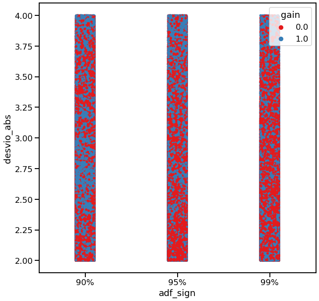

<!-- PROJECT SHIELDS -->
<!--
*** I'm using markdown "reference style" links for readability.
*** Reference links are enclosed in brackets [ ] instead of parentheses ( ).
*** See the bottom of this document for the declaration of the reference variables
*** for contributors-url, forks-url, etc. This is an optional, concise syntax you may use.
*** https://www.markdownguide.org/basic-syntax/#reference-style-links
-->
[![LinkedIn][linkedin-shield]][linkedin-url]

<!-- PROJECT LOGO -->
 

  

  <h3 align="center">Cointegration Trading w/ Machine Learning</h3>

<!-- TABLE OF CONTENTS -->

 
  
Table of Contents

  <ol>
    <li>
      <a href="#about-the-project">About The Project</a>
      <ul>
        <li><a href="#built-with">Built With</a></li>
      </ul>
    </li>
    <li>
      <a href="#getting-started">Getting Started</a>
    </li>
    <li>
      <a href="#definition">Project Definition</a>
    </li>
      <ul>
        <li><a href="#background-and-statistical-concepts">Background and Statistical Concepts</a></li>
        <li><a href="#project-approach-and-definition">Approach and Specifications</a></li>
        <li><a href="#data-modeling-process">Data modeling process</a></li>
        <li><a href="#model-evaluation-and-results">Model Evaluation and Results</a></li>
      </ul>
    </li>
    <li><a href="#development-topics-and-challenges">Development Topics and Challenges</a></li>
    <li><a href="#data-visualization">Data Visualization</a></li>
    <li><a href="#online-rollout">Online Rollout</a></li>
    <li><a href="#contact">Contact</a></li>
    <li><a href="#references">References</a></li>
  </ol>

<!-- ABOUT THE PROJECT -->
## About The Project

The Project main objetive was to explore the statistical properties of cointegration applied to pairs of companies stocks (B3-Brazil Listed Companies) in a manner where the equities could be traded in a Long & Short fashion**, thus reducing capital required to trade and exposure to the market volatility. Secondary goal was to design and implement the framework to collect, store, manipulate and explore data from the B3 Database in the Cloud, building the path to other trading strategies that could benefit from the system backbone.

** long-short investment strategies are usually considered absolute return strategies, meaning that they have only negligible exposure with respect to a representative market index, since the procedure is to sell one stock and buy the other simultaneously.

### Built With

* Python
* SQL
* Google Cloud
* Scikit / Sklearn / Statsmodels (*)
* Matplotlib / Seaborn (*)

(*) Python libraries used for ML/Statitical Methods and Data Preparation/Data Visualization,  

<!-- GETTING STARTED -->
## Getting Started

** IMPORTANT     ** This project contains intellectual proprerty, thus, not all details are disclosed in this article.  
** IMPORTANT II  ** This Article does not have the pretension to be an academic publication, although it has some similarities in it's structure  
** IMPORTANT III ** The objective of this article is to provide overall unstanding of the concept and concepts used, the topics are not scrutinized at full lenght

<!-- GETTING STARTED -->
## Project Definition

<!-- Statistical -->
### Background and Statistical Concepts

  A pairs trading strategy that is based on statistical procedures is a special form of statistical arbitrage investment strategy. Cointegration, which is the main subject of this project, was largely introduced in the financial market by the work of Do, Faff, and Hamza (2006). The cointegration method is a model based, parametric approach that assumes the existence of a common stochastic trend in the price series of two financial assets. In order to understand the concept, it is important to be familiar
  with the idea behind stationary and non-stationary time series **[[Suggested Reference]](https://otexts.com/fpp2/stationarity.html)**. An important feature of two cointegrated time series is that there exists a linear combination of the two non-stationary time series that has a constant mean, which can be explored as a "mean reverting" trading strategy, betting that the relation between the two time-series will prevail and return to the mean, as long as the pair is cointegrated. The only problem that remains, is the issue that we do not know whether two time series, are actually cointegrated or not.

  There are several different approaches to address this issue, the method used on this project was to fit a ordinary least square regression (OLS) between the daily close prices of two stocks plus the time variable, to further explore this concept, consider that we have two time series composed by the daily close prices of Stocks A and B, for each pair A/B we performed regressions such as described below for multiple time-series sizes (E.g 100, 120, ..., N - Historical Daily Close Prices):
  

               Y(price A) = αt + βX(Price B) + ε , for t = 1, . . . , T

  The idea behind this procedure is to get the regression error term (ε) for each T and this time-series is assumed to be Stationary. To test this Null Hypothesis, it was  performed the augmented Dickey-Fuller test (ADF)**[[Suggested Reference]](https://en.wikipedia.org/wiki/Augmented_Dickey%E2%80%93Fuller_test)**, and considered as a candidate for trading those pairs that had a test statistic greater than the 5% critical value for multiple periods considered in the regression, as stated above we performe multiple regressions with different data collection sizes to achieve greater confidence ( Last 100, 120, ..., N daily closes), later the number os historical periodos cointegrated was used as a feature of the model.

  In the image below it is possible to see an example of the plotted Z-Score of the Error term from a pair of cointegrated Stocks; rigourously, the error term from the regression of the Stocks is a stationary time-series, but in order to simplify, we will refer as a cointegrated pair of Stocks; 

   
  

    

  The main idea for implementing cointegration as a pair trading strategy is to constantly monitor pairs os stocks and trade them whenever the Z-Score **[[Suggested Reference]](https://en.wikipedia.org/wiki/Standard_score)** went further than 2 standard deviation from the average. In IMAGE 01, you can see that the latest point recorded was between +1 and +2 standard deviations, therefore it could not be traded at that moment.  When the Z-Score (for a given A/B pair) value gets smaller than zero, this implies that, security A is undervalued in terms of security B, in which case we short-sell security B and purchase security A. If the Z-Score is larger than zero, we short-sell security A and purchase security B.

  Nevertheless, our project faced two major problems. For one, there is evidence that, due to the current heavy arbitrage activity in the financial market, simple cointegration trading returns are dwindled with tighter spreads and less trading opportunities, as stated by Hoel, 2013. Aditionally, there is no data-based approach available to provide wide understanding of how the cointegration investiment strategy performs applied to the Brazilian equity market. Our project proposition would have to address those  two major Issues, along with many other limitations, as we will see in the next sections.

<!-- Approach -->
### Project Approach and Definition

To Approach this scenario, our proposal was to create a consistent dataset that could shed some light into the brazilian stock market regarding cointegration investing and design a intelligent system that could benefit from such database and achieve higher accuracy than simple cointegration investing.

Creating a database to work with, meant to us that we needed to gather a representative historical dataset of cointegration trading candidates, along with its native characteristics and market conditions at the moment of the trade, and, of course, if the trading candidate was profitable or not. To achieve that, we could assemble, with financial market community, through a poll-like inventory, all cointegration trades performed in the last years and use this information to contruct the dataset. Obviouly, that endevour would never be succesfull, most players dont keep an accurate track of its investing history, and those who did would never disclose such sensitive information.

To address that, we decided to create our own historical dataset of cointegration trading, by running a massive exploration on the last years of all possible candidates to gather/construct its inherent cointegration information <a href="#1a">**(1)**</a> and market conditions for that moment. To accomplish that we had to plan what information would be usefull for the future model and scan each pair of stocks for every point in the timeseries (last 5 years), this proved to be a computational challenge since we had to run several regressions <a href="#1b">**(2)**</a>, statitical manipulations, which included the expensive (and primordial) cointegration test (ADF), for every datapoint, over all possible Ibovespa stock pairs (exactly 3906) for the last 5 years. The effort would be proportional to the timeframe considered in the historic data exploration, for instance, we could perform the search every 1, 5, 10, 15 minutes, or any other timeframe in accordance with the frequency of price data available in the database that we used. There was a trade-off between higher and lower frequencies to considered on the search, if the search were to be made on high frequency, we could bring too much "noise" to the dataset and the exploration could take weeks (if not months!!!) of computational time, based on the infrastructure that we had available on the cloud, in the other hand if the search were to be executed on higher frequencies, we faced the risk that the data could not be representative for building a model upon. 

With the dataset in hands <a href="#1c">**(3)**</a>, we had to increment it with aditional information required for the modeling we intended to create, this step was executed on a subset of the greater database, composed exclusively by actual trading candidates, which were selected based on a set of rules that defined the minimum requirements that a pair should meet at any given time. For example, we would not trade a given pair of stocks that were cointegrated only for the last 100 days or a pair that the Z-score spread were not beyond, at least, +/-2 standard deviations. The most important additions we made to the dataset were features capturing market conditions (e.g. historical volatility), cointegration stability (e.g is the Z-Score returning at that moment after a wider spread?) and the trade financial result, were the trade taken at that moment. To measure financial results, we had to came up with policies for when to take profits, loss or abandon the trade, for instance, we could decide, based on the total financial amount moved by the trade <a href="#1d">**(4)**</a>, to take profits with 2% and loss of 1% and abandon the trade if reaches its statistical half-life.

 

 (1) By inherent cointegration information we mean all atributes and properties related to the cointegration at that moment, e.g. The T-statistic product of the ADF Test or the Z-Score of the regression error term at that moment, some os these information will be finally used as features consumed by the Machine Learning algorithm, we will further explore this subject in the next sections of this article.  

 (2) As Stated above, for every candidate, we decided to run several regressions considering different timeframes to achieve higher confidence (last 100 days, 120 days, ......, N Days), this would mean that the greater is the number of cointegrated periods the higher was the confidence that the candidate was indeed cointegrated at that moment. 

 (3) At that moment, the dataset was composed by a 5-year time-series for each pair, that included basic cointegration information along with statitical estimates produced concurrently, including, of course, the results of the cointegration test executed, which was the most basic information to determined if that pair can be traded at any given moment.  

 (4) Remember, this is a Long & Short financial operation, for example, consider the pair ITUB4/PETR4, if all requirement for trading are met we would long ITUB4 and short PETR4, or short ITUB4 and long PETR4, this would depend if the Z-score were positive or negative, for this particular example, if the Z-score is positive that means ITUB4 is overvalued in terms of PETR4, in that case we would short ITUB4 and purchase PETR4.

<!-- Data -->
### Data Modeling Process

Concluded the stage of creating the project dataset, that, at that moment, consisted of trades for all possible Ibovespa pairs over the last 5 years which passed the cointegration test and met our rules of minimum requirements, the next step would be to take advantage of this data, we planned to create a model based on sistematic trading rules (learned by data exploration) and, in parallel, train Machine Learning algorithms to compare the performance to different market cycles.

First of all, we had to guarantee the integrity of the data we generated, some of those findings are listed in the data visualization section of this article, the data seem to be of good quality, with clear normal distribution among its many features, some outliers where dealt with, and all procedures required for data preparation were implemented, such as cleaning for missing values <a href="#1e">**(1)**</a>, normalization, encoding text and categorical atributes.

The sistematic trading rules system were the first to be implemented, different sets of trading rules (derived from the dataset features) were created based on expert financial knowledge, for instance, a simple trading rules would be to trade cointegrated pairs that have 1% of critical value as result of the ADF Test and Z-Score that exceeds +/- 3 standard deviations (that was not one of the Trading rules we used). The financial results, for each set of rules, were measured on historical data using a unique backtesting system that we design to simulate limitations that are intrinsic to real investiment, such as, limitation in the number of trades that could be open at the same time and limitation on cash available for margin guarantees required by the financial institutions, also, the results were computed averaging multiple randomized scenarios to mitigate the risk of overfitting. 

The next step was to train Machine Learning algorithms on our data, the appproach was to not make any assumptions on what learning method would be better or select features based on intuition, we followed the "No Free lunch Thoerem", as stated in the famous 1996 paper <a href="#1f">**(2)**</a>. Despite that, implementing showed to be a greater challenge than initially expected since most supervised learning methods expect i.i.d data **[[Suggested Reference]](https://statisticsbyjim.com/basics/independent-identically-distributed-data/)**, the initial results were disapointing, we were actually working with a multivariate time-series, most time series analysis methods, and even books on the topic, focus on univariate data. This is because it is the simplest to understand and work with. Multivariate data is often more difficult to work with. It is harder to model and often many of the classical methods do not perform well.

Time series forecasting can be re-framed as a supervised learning problem, and thats what we did, instead of treating the Z-Score as a signal and try to predict its behavior in the future <a href="#1g">**(3)**</a>, we framed the problem as a binary classification, training the model to predict if a trade would be profitable or not, based on the variables (features) at the very moment the trade would be opened. To do that, we had to get rid of all information that could expose our model to future-looking, since some features have a temporal dependency between observations, the model could only decorate these relationships and overfit the training set. To compensate that we incorporated some seasonal variables that reflected market condition as new features (Ex. Volatility, Number of trades generated by the pair in the last N days), this would provide the means for the algorithm to learn how seasonal market conditions affected the likelihood of trades being profitable.

In summary, we created a list of model candidates by combining different sets of learning methods, dataset features and algorithm hyperparameters, all driven to address a binary classification problem which was, **Is this trade likely to be profitable?** We evaluated the quality of answers to this question according to the scheme descrebed in the next section of this article.

 (1) You may wonder how could we have missing values since we created our own dataset, many of our procedures were implemented with paralell processing and took many days to finish, some of them (less than 0,1%) returned with missing values, due to particular reasons that are not worth exploring here.

 (2) David Wolpert demonstrated that if you make absolutely no assumption about the data, then there is no reason to prefer one model over any other. This is called the No Free Lunch (NFL) theorem. For some datasets the best model is a linear model, while for other datasets it is a neural network. There is no model that is a priori guaranteed to work better (hence the name of the theorem). The only way to know for sure which model is best is to evaluate them all. Since this is not possible, in practice you make some reasonable assumptions about the data and you evaluate only a few reasonable models.

 (3) Remember, the whole point of our approach to cointegration is that, once we have confirmed one pair of stocks to be cointegrated, we will take advantage of that and bet that every time one stock gets overvalued or undervalued in terms of the other, the spread (in our case Z-Score) will return to the average, as long as the pair remain cotintegrated.

<!-- Results -->
### Model Evaluation and Results

To evaluate the results of our models, we did not use classical train/test split of data, instead, we used a walk-forward approach. When dealing with time-related and dynamically changing environments, where the characteristics of the environment change throughout time, it is best to use time-based splitting to provide statistically robust model evaluation and best simulate real-life scenarios. For this we should use time-based cross validation, a method taken from the time-series field, which forms a type of “sliding window” training approach, as you can see represented in the image below. In this method, older data is dropped while we move to further steps (or walks as we will refer to), this is particular usefull for our dataset, since the features that we engineered to capture financial market seasonality usually lost predictive power the older it gets. Other methods, such as traditional cross-validation or K-fold, create several slices of data that are shuffled to create multiple train/test splits, those could be applied to our project either, we cannot choose random samples and assign them to either the test set or the train set because it makes no sense to use the values from the future to forecast values in the past.
 

  
 

Evaluating a classifier is often significantly trickier than evaluating a regressor, there are many performance measures available, along the way we kept track using the confusion matrix, but in the end decided for optimizing the model based on positive predictive value, also know as Precision.

 

  
 

Using precision for evaluating and optimizing our models, meant that we settle for having a higher accuracy in predicting if a trade would be profitable or not, but, also meant that we would incur in having a high level of False Negative. In other words we would miss many profitable trades, and, to achieve the levels of precision we were expecting we could end up creating a highly selective model that would flag only a few trades monthly and that ought to affect our confidence interval. To mitigate this we diversified our model list with candidates that had different restriction levels.

In the end, machine learning models outperformed the sistematic rules trading system, in terms of precision, but specially in terms of stability <a href="#1h">**(1)**</a>. This was particullar important, equilibrium was one of our main goals by using lerning methods, and this is one of the most critical issues of implementing automatic trading systems, because if you build a trading system that has, on average, good returns but suffer from wild variations (extremelly good and bad periods) you could, potentially, endup losing your account, and that is much more frequent than an unadvised person could guess.

Finally, sistematic trading rules end up having, on average 64% precision <a href="#1i">**(2)**</a> with 18% of standard deviation based on different measurement periods. Learning models had 69% precision on average, with only 6% of standard deviation, you might think that this difference is small, but it is more than enough to offset all trading costs <a href="#1j">**(3)**</a>, besides the fact that sistematic systems were much less adaptable to different market condition and had to be much more restrictive, flagging considerably less trades on the same period, considering only learning models that produce around the same amount of trades monthly, we achieved 73% of precision.

Those results showed evidence that cointegration investment strategy using machine learning could be profitable in the brazilian stock market, aditionally, we continued the studies by applying our models to fresh data for the 2nd half of 2020 and the results were in line with what we presented above.  

 (1) By stability, we mean that had the ability to generalize, or the model's ability to adapt to different market conditions, such as neutral or high volatility markets, bull markets or bear markets. We could do that by analysing to what conditions the models were exposed in the walks of the sliding windows approach.

 (2) Those values are based on the sliding windows approach and collected with our backtest systems that was mentioned above.

 (3) Trading costs is not a subject to be neglected, there are many different ways to set up your system that can affect profitability, for instance, acquiring a proprietary trading algorithm, which is responsable only for delivering your orders could be expensive, but also improve your response time to trade, keep in mind that delays can make you miss trades or enter in different price conditions compared to what you fed to your learning method 

<!-- Development -->
## Development Topics and Challenges

* Market data (Stock Price) was obtained through the use of a python library that collect data directly from financial institutions database, we used the metatrader 5 platform connecting on the Rico Investimentos broker, the data was in line with B3 price reference Database.

* Our dataset was created by scaning historical data every 30 minutes, we called this the CubeGenerator function, our database had more than 400MM lines with around 50 features.

* The first version of the Cube Generator was expected to take more than 120 days of processing time, we had to heavily optmize it, improving iteration/looping structures, migrating from pandas dataframe to dictionary on many of the manipulations and improving pandas indexing where dataframe manipulation remained.

* The CubeGenerator function consisted of a Scan that iterated through intraday prices of a given pair of stocks A/B, to test if, at that moment, the pair was cointegrated. In other words, for each intraday point in the time-series, was performed a regression to describe the price of the stock A in terms of stock B, concatenating the series of N-1 closing day prices and the intraday price in question. The error term product of this regression was transformed into a Z-Score series and tested for stationarity using the Augmented Dickey-Fuller test. This was executed multiple times, on different N's (100 days, 120 days, 140 days.....), as stated previouly.

* Aditionally, we executed Cube Generator using Python ProcessPoolExecutor from concurrent.futures, distributing the creation of the cube for a single stock pair as a process on the CPU available, we had almost 4k pairs on the loop.

* We used adftest, OLS functions from statsmodels to perform the stationarity test and regression respectively.

* To simulate trading results (finantial) we had to scan price evolution to capture when our profit/loss criteria would be fulfilled, this was executed for each trade on every pair, scaninng prices every 30 min.

* It's mathematically challenging to calculate profit/loss in finantial terms ($$$) for a movement of N Standard-deviations on the Z-Score, remember that the Z-Score is a normalized version of the regression error term and you want to know for a given pair of stocks A/B how much relative movement on the prices would make for the corresponding expected movement in terms of standard deviation of the error term.

* Since our dataset had relativelly large size, we had to came up with a stratified sample of trades that respected the global representativity, otherwise it would be impractical to use learning systems online due to the response time, this also solved a problem that we noticed with our dataset, there were large clusters of data generated by persistent pairs over the period of a few days. This occured because the pair was in trading condition this whole time, but the cointegration characteristics were almost identical, thus creating a source of bias on the dataset.

* The learning algorithm we used for this project were Logistic Regression, Random Forest and Gradient Boosting, the later outperform its companions though.

* We created our own gridsearch library for hyperparameter optimization, the ones available on python libraries used evaluation metrics that were not adequate for our purposes.

* Since we optimized our models to have higher precision feature selecion was not an easy task. It is known that there is no best method for selecting the best features from your data set to your model, instead, you must discover what works best for your specific problem using careful systematic experimentation, there is a large range of different methods to approach that, we used a combination of feature importante from Random Forest and field expert knowledge.

* We had to use the function predict_proba from the classifiers instead of just taking the binary return from the standard predict function. This function provides a probability estimate provided by the classifier, in our case, the chances estimated by the model of having profits or not. We use 70% or higher as the threshold, now as you raise the threshold, thereby increasing overall precision you endup flaggind less and less profitable trades.

<!-- Data -->
## Data Visualization

 

  

The image above show the distribution of trades in terms Z-Score mearures (How many Standard Deviation away from the mean), we can clearly see the normal distribution curve.

 
 

  

The image above it a measurement of frequency density between the Z-Score and ADF Test Statistics (the smaller the better) and shows that the high majority of trades are concentrated between 2 and 2.5 Standar Deviations and -3,25 and -4 on T-Statistic. Both parameters had an entry on our minimum requirement trading rule list, and the did not include most part of the ranges depicted on this plot.

 
 

  

The image above showed the relation between the T-Statistics and the number of periods that pair was cointegrated, you can see that if you have more periods, the results of the tests came better giving a higher concentration of 1% critical value (or 99% on the Stationarity Test)

 
 

  

The image above show us Test Statistics versus Number of Days cointegrated, its a pretty regular distribution, showing that there was no clear distinction between Stationarity test results and the size of the time series sample tested.   

 

  

The image above it a measurement of frequency density between ADF Test Statistics and the Half-life of trades, indicating a possible correlation between higher T-statistics and lower half-life, which meant that trades that had an lower estimate of days to return to its Z-Score Average had better results in the Cointegration Test.   

 
 

  

The image above showed concentration of profitable trades between Z-Score and Half-life, showing that the section between 2 and 3 Standard seemed to have less proportion of profitable trades. We thought we could find some "sweet spots" as an unadvised person could conclude at first glance, but some of the regions had only marginal higher concentration of winning or losing trades.

 
 

  

The image above show us concentration of profitable trades between Z-Score and critical values for the stationarity test. It is possible to see that there is no important concentration of profitable trades. One could conclude, based on the last two images that there is no "easy to spot", simple rules, that we could apply to obtain an edge when investing using the cointegration method, and, that is precisely our findings, there are many subtle relations between the dataset features and profitability of trades that could only captured by the learning methods.
 

<!-- Online -->
## Online Rollout

The implementation of the models into a online stock market is not the scope of this article since it is sensitive intellectual property, please, find the contacts below for further information.

<!-- CONTACT -->
## Contact

Giovanni Rizzo - paiva.giovanni@gmail.com   
Rafael Dias - [@rafael_rdias](https://twitter.com/rafael_rdias) - rrdias108@gmail.com

Project Link: [https://github.com/ra024940/Pair_trading_Cointegration](https://github.com/ra024940/Pair_trading_Cointegration)

<!-- References -->
## References

* Evan Gatev, 2006, Pairs Trading: Performance of a Relative Value Arbitrage Rule.
* Do, B., Faff, R. and Hamza, K. (2006) A New Approach to Modelling and Estimation for Pairs Trading.
* Hoel Christoffer Haakon, Statistical Arbitrage Pairs: Can Cointegration Capture Market Neutral Profits?
* Harlacher Markus, 2016, Cointegration Based Algorithmic - Pairs Trading, Dissertation of the University of St. Gallen

<!-- MARKDOWN LINKS & IMAGES -->
<!-- https://www.markdownguide.org/basic-syntax/#reference-style-links -->
[linkedin-shield]: https://img.shields.io/badge/-LinkedIn-black.svg?style=for-the-badge&logo=linkedin&colorB=555
[linkedin-url]: https://www.linkedin.com/in/rafadias/
